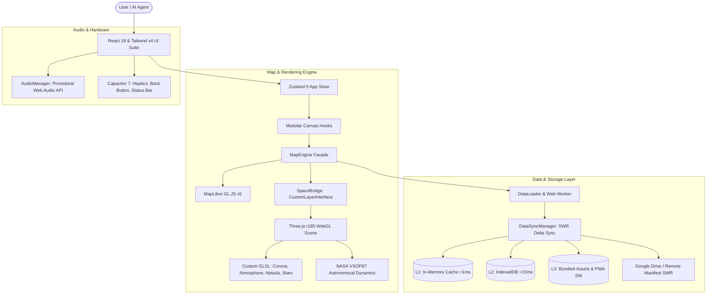

# TerraMetrics 3D: High-Level Architecture Guide 🏛️🌐

## 1. System Architecture Diagram

---

## 2. Key Architectural Invariants

### 120 FPS Zero-GC SLA
- All hot-loop matrix transformations, coordinate conversions, and ephemeris calculations reuse preallocated scratch vectors and quaternions.
- Verified by automated continuous frame profiler (`ZeroGCSpy`) across 1,200 continuous frames.

### WebGL State Multiplexing
- Three.js and MapLibre share a single WebGL2 canvas context via `CustomLayerInterface`.
- Full attribute array unbinding, texture unbinding, program resets, and `painterContext.setDirty()` eliminate state collisions.

### 100% Deterministic Offline Operation
- When offline, `DeterministicSolarClimateEngine` models solar geometry, Tetens vapor pressure, and atmospheric insolation without network latency.
- IndexedDB + Service Worker precaches offline dataset fallback.
